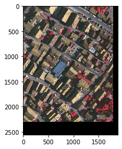
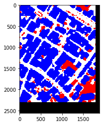

# Sematic Segmentation


## About this project


This git is my dummy implemetation about Semantic Segmentation tasks with TensorFlow and Keras. At first step, I started this project with some basic deep learning models in semantic segmentation task, such as FCN (Fully Convolutional Network) and U-Net. These models are trained with Kitti Road Dataset (download [here](http://www.cvlibs.net/datasets/kitti/eval_road.php)) and ISPRS Dataset ([link dataset](http://www2.isprs.org/commissions/comm3/wg4/tests.html)). 

## Updates


* [29 June 2019](https://github.com/kuro10/Sematic-Segmentation/tree/6c3bab3126619621b238895e1f9a6f11563874cf) : The first version of this project is well done for training a FCN-Alexnet model with Kitti Road Dataset. However, it is quite difficult to restore this model for a prediction. So these constraints will be optimized in the following update. 

* [5 July 2019](https://github.com/kuro10/Semantic-Segmentation/tree/928f7b5b16fff1d7502bfe365353dd5c761abffe) : This version is the implementation of FCN-Alexnet, U-Net and FCN-8s (based on VGG16-Net), training with Kitti Road Dataset. Also, transfer learning and fine tuning are applied when using FCN-8s (restore weights from file [vgg16.npy](https://github.com/machrisaa/tensorflow-vgg), another solution is to use the checkpoint [vgg_16.ckpt](https://github.com/tensorflow/models/tree/master/research/slim) that will be developped in the future). The idea about "caching the frozen layers" is tested but not really work yet, this idea will be also developped in the future.

* [9 July 2019](https://github.com/kuro10/Semantic-Segmentation/tree/99b821353d957016ecc2a3873303f3e9d730c5f8): This version update the demos for training and predicting with Kitti Road Dataset, by using FCN-AlexNet, U-Net and FCN-8s (demos in files notebook *.ipynb*). However, there is also some bugs about saving and restoring the model. In fact, the model cannot be restored when using the module **tf.train.Saver**, but it works if I use the module **tf.saved_model**. Any idea? 

* [18 July 2019](https://github.com/kuro10/Semantic-Segmentation/tree/6e5cd740f9f10143087cd8ec5e146b4a9fc1ee52): This version deals with ISPRS Dataset (on the Vaihingen dataset) along with the implementation of the base FCN in semantic labeling task. The model is tested with only 3 classes : road, buiding and background. 

  


## How to use in Jupyter Notebook ?

***1. Training step***

* Create a configuration file .json 

```
"exp_name" : Folder that you want save the checkpoints and summaries for tensorboard

"num_epochs" : Number of epochs for training, pay attention to overfitting !

"num_iter_per_epoch" : Number of iterations executed in each epoch

"learning_rate" : Used for optimizer. So, what is the best rate ? How to choose the best 
learning rate ?  

"batch_size" : Number of samples used for training in each iteration

"max_to_keep" :  Number maximum of checkpoints that you want to keep

"data_path" : Path to dataset

"image_size" : Input image size with format [height,width,channels]

"loss" : Name of loss function you want to use

"accuracy" : Name of accuracy function you want to use
```

* Read the config file

```python
from utils.config import process_config 

config = process_config("PATH/TO/CONFIG/FILE")
```

* Create your data generator

```python
from data_loader.kitti_road_data_loader import KittiRoadLoader

data = KittiRoadLoader(config)
```

* Create and build an instance of model

```python
from models.fcn_alexnet_model import FcnAlexnetModel

model  = FcnAlexnetModel(config)

model.build()
```
* (*Optional*) Create a builder for saving the model 

```python
builder = tf.saved_model.builder.SavedModelBuilder(config.final_model_dir)
```

* Create a session

```python
from tensorflow as tf

sess = tf.Session()
```

* Create an instance of logger for saving checkpoints and summaries.

```python
from utils.logger import Logger 

logger = Logger(sess,config)
```

* Create an trainer for training the created model with your above dataset

```python
from trainers.road_trainer import RoadTrainer

trainer = RoadTrainer(sess,model,data,config,logger)
```

* Train your model by the trainer

```python
trainer.train()
```

* (*Optional*) Load your model if exists, then saving the final model in binary files. These files will be used for predicting the results or deploying with TensorFlow Serving. 

```python
model.load(sess)
print("Saving the final model..")
builder.add_meta_graph_and_variables(sess,
                                   [tf.saved_model.tag_constants.TRAINING],
                                   signature_def_map=None,
                                   assets_collection=None)
builder.save()
print("Final model saved")
```

* Close the session when you finish 

```python
sess.close()
```

***2. Predict results with trained model***

* If you don't close the the training session yet, you can predict the result by insert directly these lines before closing the session : 

````python
model.load(sess)
test = [data.get_data_element("test_data",i) for i in range(5)]
for item in test :
    img = item[0]
    mask = item[1]
    model.predict(sess,img,mask)
    
sess.close()
````
* Or if you want to predict the results in another session

```python
with tf.Session() as sess:   
    print("Loading final model ")
    tf.saved_model.loader.load(sess, [tf.saved_model.tag_constants.TRAINING], config.final_model_dir)
    print("Final model loaded")
    test = [data.get_data_element("test_data",i) for i in range(5)]
    for item in test :
        img = item[0]
        mask = item[1]
        model.predict(sess,img,mask)
```

## How to run the demo project with python script ?

***1. Start the training***

```
python road_segmentation.py -c configs/unet_KittiRoadDataset_config.json
```

***2. Start Tensorboard visualization***

````
tensorboard --logdir=experiments/unet_kittiroad/summary/
````


## References

The template is inspired from [TensorFlow Project Template](https://github.com/MrGemy95/Tensorflow-Project-Template).

