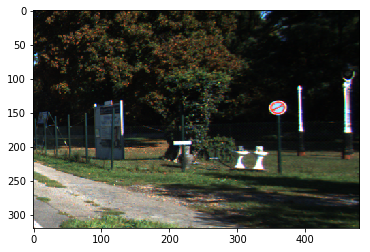
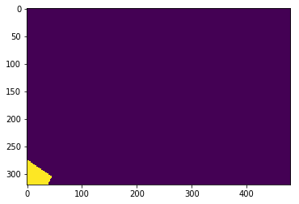

```python
import tensorflow as tf

from data_loader.kitty_road_data_loader import KittyRoadLoader
from models.fcn_alexnet_model import FcnAlexnetModel
from trainers.fcn_alexnet_trainer import FcnAlexnetTrainer
from utils.config import process_config
from utils.dirs import create_dirs
from utils.logger import Logger
from utils.utils import get_args
import matplotlib.pyplot as plt
import os 
json_file = "configs/fcn_alexnet_KittyRoadDataset_config.json"
json_file

config = process_config(json_file)
print(config)


```

    batch_size: 2
    checkpoint_dir: ./experiments\fcn_alexnet_kittyroad\checkpoint/
    data_path: C:/Users/TT260256/My Project/NNs/data_road
    exp_name: fcn_alexnet_kittyroad
    image_size:
    - 320
    - 480
    learning_rate: 0.00023949513325777832
    max_to_keep: 5
    num_epochs: 30
    num_iter_per_epoch: 100
    summary_dir: ./experiments\fcn_alexnet_kittyroad\summary/
    
    


```python
data = KittyRoadLoader(config)
img, mask = data.get_data_element("all_data",0)
```

    Yeah this is the path to dataset : C:/Users/TT260256/My Project/NNs/data_road
    Size of all raw images :  289 samples with size  (375, 1242, 3)
    Size of all raw labels  :  289 samples with size  (375, 1242, 3)
    Size of all raw masks  :  289 samples with size  (375, 1242)
    Pre-processing the data...
    Size of images collection :  (2312, 320, 480, 3)
    Size of masks collection :  (2312, 320, 480)
    


```python
img, mask = data.get_data_element("all_data",700)
plt.imshow(img)
plt.show()
plt.imshow(mask)
plt.show()
```








```python
# create the model
model = FcnAlexnetModel(config)
# model.summary()
```


```python
with tf.Session() as sess :
    # create tensorboard logger
    logger = Logger(sess, config)
    # create trainer and pass all the previous components to it
    trainer = FcnAlexnetTrainer(sess, model, data, config, logger)
    #load model if exists
    model.load(sess)
    # here you train your model
    trainer.train()
    #load model if exists
    model.load(sess)
    #predict
    print("I want to predict sth...")
    model.predict(sess,img)
```

    100%|████████████████████████████████████████████████████████████████████████████████| 100/100 [03:17<00:00,  1.96s/it]
    

     Last epoch loss :  0.32197148
     Last epoch accuracy : 0.8223202
    Last test loss : 0.24409173
    Last test accuracy :  0.87794036
    Saving model...
    Model saved
    

    100%|████████████████████████████████████████████████████████████████████████████████| 100/100 [03:13<00:00,  1.95s/it]
    

     Last epoch loss :  0.23567499
     Last epoch accuracy : 0.88507825
    Last test loss : 0.18036662
    Last test accuracy :  0.92016554
    Saving model...
    Model saved
    

    100%|████████████████████████████████████████████████████████████████████████████████| 100/100 [03:15<00:00,  1.89s/it]
    

     Last epoch loss :  0.18653423
     Last epoch accuracy : 0.9232242
    Last test loss : 0.18373086
    Last test accuracy :  0.9364635
    Saving model...
    Model saved
    

    100%|████████████████████████████████████████████████████████████████████████████████| 100/100 [03:19<00:00,  2.02s/it]
    

     Last epoch loss :  0.1353562
     Last epoch accuracy : 0.942764
    Last test loss : 0.14581057
    Last test accuracy :  0.9492248
    Saving model...
    Model saved
    

    100%|████████████████████████████████████████████████████████████████████████████████| 100/100 [03:18<00:00,  2.00s/it]
    

     Last epoch loss :  0.13410737
     Last epoch accuracy : 0.945265
    Last test loss : 0.122908756
    Last test accuracy :  0.9486753
    Saving model...
    Model saved
    

    100%|████████████████████████████████████████████████████████████████████████████████| 100/100 [03:13<00:00,  1.94s/it]
    

     Last epoch loss :  0.118957885
     Last epoch accuracy : 0.9494871
    Last test loss : 0.132713
    Last test accuracy :  0.94675136
    Saving model...
    Model saved
    

    100%|████████████████████████████████████████████████████████████████████████████████| 100/100 [03:16<00:00,  2.00s/it]
    

     Last epoch loss :  0.12571177
     Last epoch accuracy : 0.94703513
    Last test loss : 0.1886046
    Last test accuracy :  0.92441565
    Saving model...
    Model saved
    

    100%|████████████████████████████████████████████████████████████████████████████████| 100/100 [03:16<00:00,  2.00s/it]
    

     Last epoch loss :  0.13698786
     Last epoch accuracy : 0.94589394
    Last test loss : 0.12834321
    Last test accuracy :  0.9452323
    Saving model...
    Model saved
    

    100%|████████████████████████████████████████████████████████████████████████████████| 100/100 [03:16<00:00,  2.05s/it]
    

     Last epoch loss :  0.12033434
     Last epoch accuracy : 0.94698006
    Last test loss : 0.1354078
    Last test accuracy :  0.94363433
    Saving model...
    Model saved
    

    100%|████████████████████████████████████████████████████████████████████████████████| 100/100 [03:15<00:00,  1.94s/it]
    

     Last epoch loss :  0.13467953
     Last epoch accuracy : 0.94204766
    Last test loss : 0.123478554
    Last test accuracy :  0.9511793
    Saving model...
    Model saved
    

    100%|████████████████████████████████████████████████████████████████████████████████| 100/100 [03:18<00:00,  2.05s/it]
    

     Last epoch loss :  0.10431865
     Last epoch accuracy : 0.95557654
    Last test loss : 0.1522371
    Last test accuracy :  0.9535739
    Saving model...
    Model saved
    

    100%|████████████████████████████████████████████████████████████████████████████████| 100/100 [03:16<00:00,  1.95s/it]
    

     Last epoch loss :  0.09465943
     Last epoch accuracy : 0.96058637
    Last test loss : 0.11965235
    Last test accuracy :  0.95591336
    Saving model...
    Model saved
    

    100%|████████████████████████████████████████████████████████████████████████████████| 100/100 [03:16<00:00,  2.00s/it]
    

     Last epoch loss :  0.09393756
     Last epoch accuracy : 0.9614016
    Last test loss : 0.12641762
    Last test accuracy :  0.95368904
    Saving model...
    Model saved
    

    100%|████████████████████████████████████████████████████████████████████████████████| 100/100 [03:14<00:00,  1.95s/it]
    

     Last epoch loss :  0.08356446
     Last epoch accuracy : 0.9645988
    Last test loss : 0.120161965
    Last test accuracy :  0.9555769
    Saving model...
    Model saved
    

    100%|████████████████████████████████████████████████████████████████████████████████| 100/100 [03:16<00:00,  2.00s/it]
    

     Last epoch loss :  0.09444292
     Last epoch accuracy : 0.9589792
    Last test loss : 0.09013243
    Last test accuracy :  0.96251005
    Saving model...
    Model saved
    

    100%|████████████████████████████████████████████████████████████████████████████████| 100/100 [03:17<00:00,  2.01s/it]
    

     Last epoch loss :  0.09060111
     Last epoch accuracy : 0.9594602
    Last test loss : 0.1155803
    Last test accuracy :  0.95031697
    Saving model...
    Model saved
    

    100%|████████████████████████████████████████████████████████████████████████████████| 100/100 [03:18<00:00,  1.96s/it]
    

     Last epoch loss :  0.07678549
     Last epoch accuracy : 0.96837944
    Last test loss : 0.101462856
    Last test accuracy :  0.9625313
    Saving model...
    Model saved
    

    100%|████████████████████████████████████████████████████████████████████████████████| 100/100 [03:16<00:00,  1.90s/it]
    

     Last epoch loss :  0.06829658
     Last epoch accuracy : 0.9706198
    Last test loss : 0.13549057
    Last test accuracy :  0.959929
    Saving model...
    Model saved
    

    100%|████████████████████████████████████████████████████████████████████████████████| 100/100 [03:21<00:00,  2.01s/it]
    

     Last epoch loss :  0.06596289
     Last epoch accuracy : 0.97376114
    Last test loss : 0.09757154
    Last test accuracy :  0.96376276
    Saving model...
    Model saved
    

    100%|████████████████████████████████████████████████████████████████████████████████| 100/100 [03:22<00:00,  2.06s/it]
    

     Last epoch loss :  0.06402191
     Last epoch accuracy : 0.97367036
    Last test loss : 0.10370568
    Last test accuracy :  0.96044385
    Saving model...
    Model saved
    

    100%|████████████████████████████████████████████████████████████████████████████████| 100/100 [03:22<00:00,  2.02s/it]
    

     Last epoch loss :  0.063991755
     Last epoch accuracy : 0.9731765
    Last test loss : 0.093868874
    Last test accuracy :  0.96650606
    Saving model...
    Model saved
    

    100%|████████████████████████████████████████████████████████████████████████████████| 100/100 [03:23<00:00,  1.97s/it]
    

     Last epoch loss :  0.054846093
     Last epoch accuracy : 0.97820467
    Last test loss : 0.07926899
    Last test accuracy :  0.9694731
    Saving model...
    Model saved
    

    100%|████████████████████████████████████████████████████████████████████████████████| 100/100 [03:26<00:00,  2.11s/it]
    

     Last epoch loss :  0.04348639
     Last epoch accuracy : 0.98230386
    Last test loss : 0.08584137
    Last test accuracy :  0.96683687
    Saving model...
    Model saved
    

    100%|████████████████████████████████████████████████████████████████████████████████| 100/100 [03:23<00:00,  2.02s/it]
    

     Last epoch loss :  0.060410332
     Last epoch accuracy : 0.97398263
    Last test loss : 0.092874885
    Last test accuracy :  0.9680605
    Saving model...
    Model saved
    

    100%|████████████████████████████████████████████████████████████████████████████████| 100/100 [03:21<00:00,  1.97s/it]
    

     Last epoch loss :  0.05351818
     Last epoch accuracy : 0.97778314
    Last test loss : 0.083656736
    Last test accuracy :  0.9679246
    Saving model...
    Model saved
    

    100%|████████████████████████████████████████████████████████████████████████████████| 100/100 [03:21<00:00,  1.95s/it]
    

     Last epoch loss :  0.04022644
     Last epoch accuracy : 0.9836135
    Last test loss : 0.08464495
    Last test accuracy :  0.9714597
    Saving model...
    Model saved
    

    100%|████████████████████████████████████████████████████████████████████████████████| 100/100 [03:16<00:00,  2.02s/it]
    

     Last epoch loss :  0.039523594
     Last epoch accuracy : 0.9839357
    Last test loss : 0.082682386
    Last test accuracy :  0.9696667
    Saving model...
    Model saved
    

    100%|████████████████████████████████████████████████████████████████████████████████| 100/100 [03:18<00:00,  1.92s/it]
    

     Last epoch loss :  0.034442615
     Last epoch accuracy : 0.9859478
    Last test loss : 0.0802393
    Last test accuracy :  0.9737945
    Saving model...
    Model saved
    

    100%|████████████████████████████████████████████████████████████████████████████████| 100/100 [03:19<00:00,  2.00s/it]
    

     Last epoch loss :  0.042666674
     Last epoch accuracy : 0.98270446
    Last test loss : 0.12423304
    Last test accuracy :  0.95525247
    Saving model...
    Model saved
    

    100%|████████████████████████████████████████████████████████████████████████████████| 100/100 [03:18<00:00,  1.98s/it]
    

     Last epoch loss :  0.03820274
     Last epoch accuracy : 0.98456645
    Last test loss : 0.123204574
    Last test accuracy :  0.96724075
    Saving model...
    Model saved
    Loading model checkpoint ./experiments\fcn_alexnet_kittyroad\checkpoint/-3030 ...
    
    INFO:tensorflow:Restoring parameters from ./experiments\fcn_alexnet_kittyroad\checkpoint/-3030
    Model loaded
    I want to predict sth...
    


```python

```
